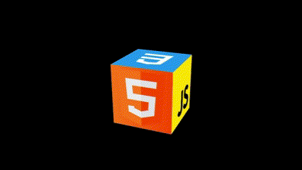

# [Animated 3D CSS Cube](https://sans-script.github.io/3D-Cube/)

Create an eye-catching animated 3D CSS cube with this simple HTML and CSS project.

## Description

The Animated 3D CSS Cube is a fun and interactive project that showcases the capabilities of CSS3 transformations. The cube rotates on its axes and reveals different images on each face. The cube is created using HTML for structure and CSS for styling and animations.

## Preview

## Features

- 3D cube animation with rotation on multiple axes.
- Different images displayed on each face of the cube.
- Hover effect that expands faces of the cube for a dynamic user experience.
- Clean and simple code for easy understanding and modification.
